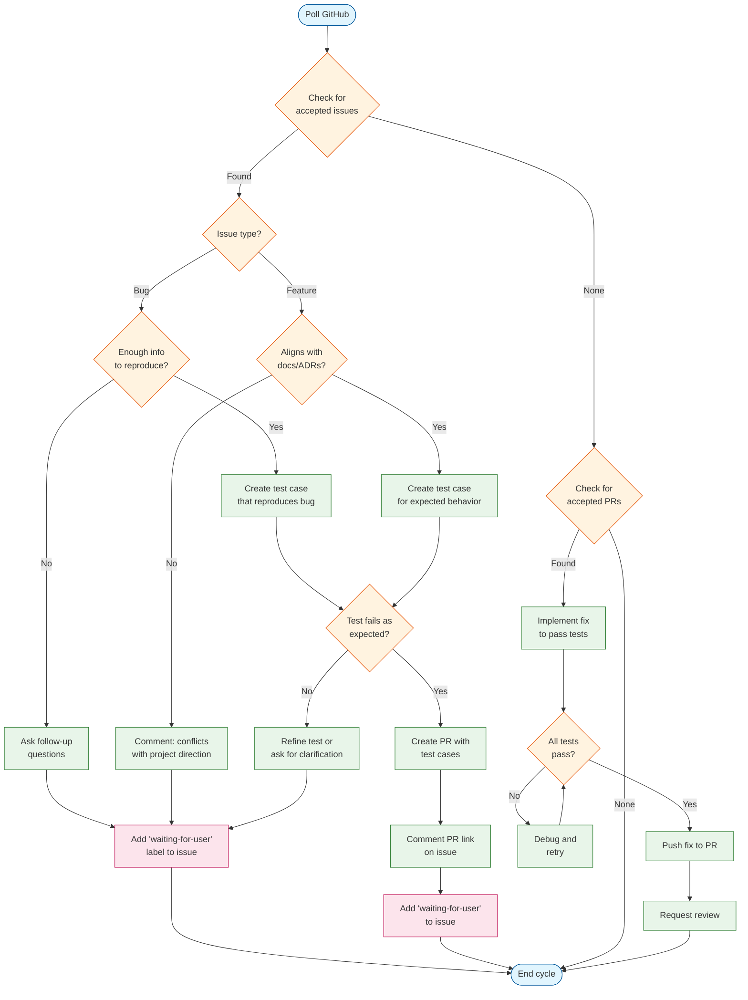
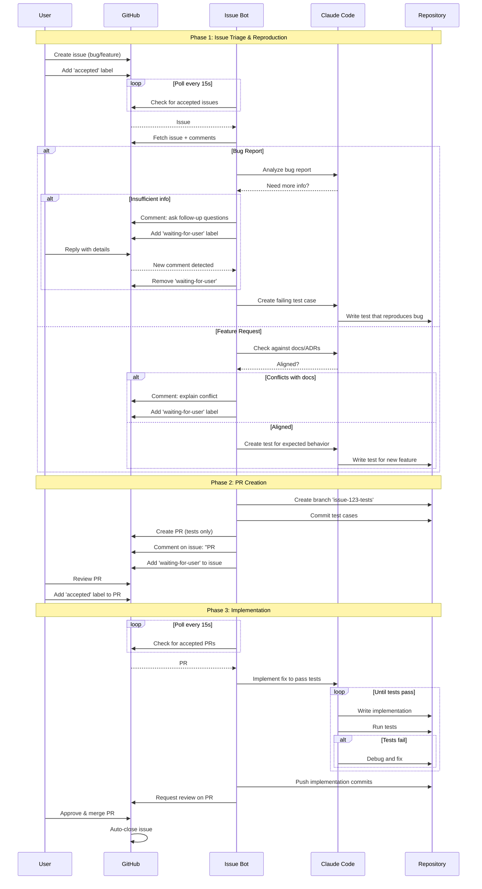
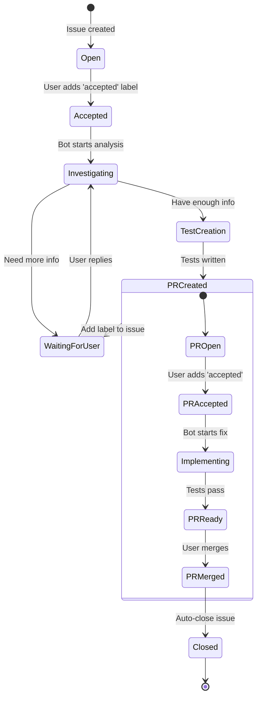

# Issue Bot Workflow

## Decision Diagram

## Sequence Diagram

## State Transitions

## Labels Used

| Label | Applied To | Meaning |
|-------|-----------|---------|
| `accepted` | Issue | Issue approved for bot processing |
| `accepted` | PR | PR approved for bot to implement fix |
| `waiting-for-user` | Issue | Bot waiting for user response/review |
| `bot-in-progress` | Issue/PR | Bot actively working |
| `bot-test-pr` | PR | PR contains only test cases (no fix yet) |
| `bot-failed` | Issue/PR | Bot encountered unrecoverable error |

## Key Changes from Current Bot

1. **Two-phase approach**: Test cases first, implementation second
2. **PR-centric workflow**: Focus moves from issue to PR once tests exist
3. **Explicit acceptance gates**: Both issues AND PRs need `accepted` label
4. **Documentation alignment check**: Features validated against ADRs/README
5. **Follow-up questions**: Bot can ask for clarification on bugs
6. **Issue-PR linking**: PR referenced in issue comment, issue gets `waiting-for-user`
