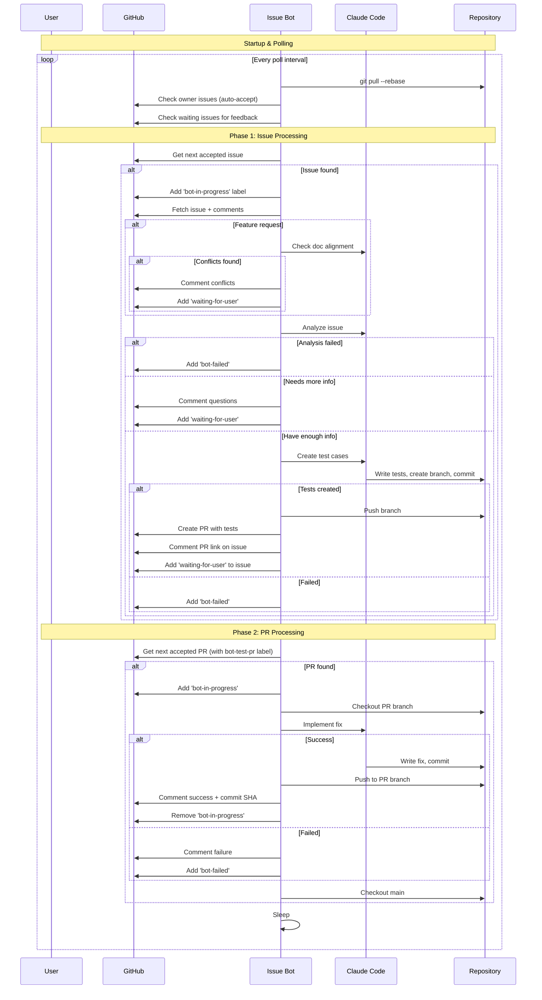
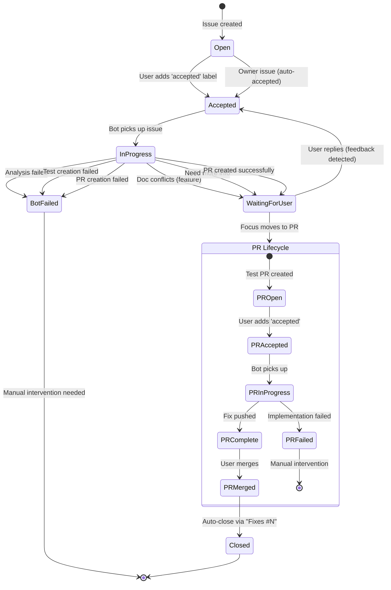

# Issue Bot Workflow

## Decision Diagram

```mermaid
flowchart TD
    START([Poll GitHub]) --> PULL[Git pull latest]
    PULL --> AUTO_ACCEPT[Auto-accept owner issues]
    AUTO_ACCEPT --> CHECK_WAITING[Check waiting issues<br/>for new feedback]
    CHECK_WAITING --> CHECK_ISSUES{Accepted issue<br/>available?}

    %% Issue Processing
    CHECK_ISSUES -->|Yes| ADD_PROGRESS_I[Add 'bot-in-progress']
    CHECK_ISSUES -->|No| CHECK_PRS

    ADD_PROGRESS_I --> ISSUE_TYPE{Has bug or<br/>enhancement label?}
    ISSUE_TYPE -->|No| SKIP_ISSUE[Remove in-progress<br/>Skip issue]
    SKIP_ISSUE --> CHECK_PRS

    ISSUE_TYPE -->|Yes, Feature| DOC_CHECK{Aligns with<br/>docs/ADRs?}
    ISSUE_TYPE -->|Yes, Bug| ANALYZE

    DOC_CHECK -->|No| CONFLICT_COMMENT[Comment: conflicts<br/>with project direction]
    CONFLICT_COMMENT --> ADD_WAITING_I[Add 'waiting-for-user'<br/>to issue]
    ADD_WAITING_I --> CHECK_PRS

    DOC_CHECK -->|Yes| ANALYZE[Analyze issue<br/>with Claude]

    ANALYZE --> ANALYZE_OK{Analysis<br/>successful?}
    ANALYZE_OK -->|No| FAIL_ISSUE[Add 'bot-failed']
    FAIL_ISSUE --> CHECK_PRS

    ANALYZE_OK -->|Yes| NEEDS_INFO{Needs more<br/>info?}
    NEEDS_INFO -->|Yes| ASK_QUESTIONS[Comment: ask<br/>clarification questions]
    ASK_QUESTIONS --> ADD_WAITING_I

    NEEDS_INFO -->|No| CREATE_TESTS[Create test cases<br/>with Claude]
    CREATE_TESTS --> TESTS_OK{Test creation<br/>successful?}
    TESTS_OK -->|No| FAIL_ISSUE

    TESTS_OK -->|Yes| CREATE_PR[Create PR with tests]
    CREATE_PR --> PR_OK{PR created<br/>successfully?}
    PR_OK -->|No| FAIL_ISSUE

    PR_OK -->|Yes| LINK_PR[Comment PR link<br/>on issue]
    LINK_PR --> ADD_WAITING_I

    %% PR Processing
    CHECK_PRS{Accepted PR<br/>with 'bot-test-pr'?}
    CHECK_PRS -->|No| END_CYCLE([Sleep & repeat])
    CHECK_PRS -->|Yes| ADD_PROGRESS_P[Add 'bot-in-progress']

    ADD_PROGRESS_P --> CHECKOUT[Checkout PR branch]
    CHECKOUT --> CHECKOUT_OK{Checkout<br/>successful?}
    CHECKOUT_OK -->|No| FAIL_PR[Add 'bot-failed']
    FAIL_PR --> MAIN[Checkout main]
    MAIN --> END_CYCLE

    CHECKOUT_OK -->|Yes| IMPLEMENT[Implement fix<br/>with Claude]
    IMPLEMENT --> IMPL_OK{Implementation<br/>successful?}
    IMPL_OK -->|No| COMMENT_FAIL[Comment: failed]
    COMMENT_FAIL --> FAIL_PR

    IMPL_OK -->|Yes| PUSH[Push changes]
    PUSH --> PUSH_OK{Push<br/>successful?}
    PUSH_OK -->|No| FAIL_PR

    PUSH_OK -->|Yes| COMMENT_SUCCESS[Comment: complete<br/>with commit SHA]
    COMMENT_SUCCESS --> REMOVE_PROGRESS[Remove 'bot-in-progress']
    REMOVE_PROGRESS --> MAIN

    %% Styling
    classDef startEnd fill:#e1f5fe,stroke:#01579b
    classDef decision fill:#fff3e0,stroke:#e65100
    classDef action fill:#e8f5e9,stroke:#2e7d32
    classDef waiting fill:#fce4ec,stroke:#c2185b
    classDef fail fill:#ffebee,stroke:#c62828

    class START,END_CYCLE startEnd
    class CHECK_ISSUES,CHECK_PRS,ISSUE_TYPE,DOC_CHECK,ANALYZE_OK,NEEDS_INFO,TESTS_OK,PR_OK,CHECKOUT_OK,IMPL_OK,PUSH_OK decision
    class PULL,AUTO_ACCEPT,CHECK_WAITING,ADD_PROGRESS_I,ADD_PROGRESS_P,ANALYZE,CREATE_TESTS,CREATE_PR,LINK_PR,CHECKOUT,IMPLEMENT,PUSH,COMMENT_SUCCESS,REMOVE_PROGRESS,MAIN,SKIP_ISSUE,ASK_QUESTIONS,CONFLICT_COMMENT action
    class ADD_WAITING_I waiting
    class FAIL_ISSUE,FAIL_PR,COMMENT_FAIL fail
```

## Sequence Diagram

## State Diagram

## Labels Used

| Label | Applied To | Meaning |
|-------|-----------|---------|
| `accepted` | Issue | Issue approved for bot processing |
| `accepted` | PR | PR approved for bot to implement fix |
| `bug` | Issue | Required: marks issue as bug report |
| `enhancement` | Issue | Required: marks issue as feature request |
| `waiting-for-user` | Issue | Bot waiting for user response |
| `bot-in-progress` | Issue/PR | Bot actively working |
| `bot-test-pr` | PR | PR contains test cases (created by bot) |
| `bot-failed` | Issue/PR | Bot encountered unrecoverable error |

## Error Handling

The bot does NOT retry on failure. If any step fails:
1. `bot-failed` label is added
2. Processing stops for that issue/PR
3. Manual intervention is required

Recoverable states:
- `waiting-for-user`: Bot resumes when user comments (feedback detected)
- `accepted` without other bot labels: Bot will pick up on next cycle

## Configuration

| Flag | Default | Description |
|------|---------|-------------|
| `-poll` | 15 | Poll interval in seconds |
| `-timeout` | 300 | Claude timeout in seconds |
| `-dry-run` | false | Print actions without executing |
| `-once` | false | Run once then exit |
